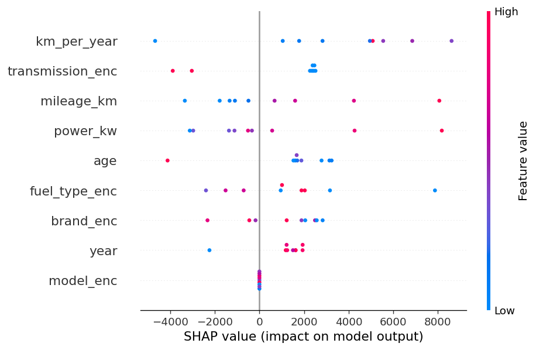

# TASKS.md — Agent Implementation Plan

> Инструкции для Claude Code. Выполняй задачи по порядку.
> После каждой задачи запускай проверку из раздела **Verify**.
> Не переходи к следующей задаче пока текущая не проходит проверку.

---

## Контекст решений

- **Scraper**: переезд с AutoScout24 (CSR, httpx не работает) на **Otomoto.pl** — server-side rendered, польский рынок, httpx + BS4 работает нативно. Playwright не нужен — меньше зависимостей, стабильнее в Docker.
- **Модель**: добавляем `power_kw` вместо `engine_l` как основной числовой признак мощности + feature engineering (`age`, `km_per_year`).
- **Data quality**: лог null-процентов после каждого scrape.
- **SHAP**: summary plot сохраняется в `assets/shap_summary.png` после обучения.

---

## TASK 1 — Переписать scraper под Otomoto.pl

### 1.1 Исследование структуры страницы

Перед написанием кода выполни:

```bash
python - <<'EOF'
import httpx
from bs4 import BeautifulSoup

url = "https://www.otomoto.pl/osobowe"
r = httpx.get(url, headers={"User-Agent": "Mozilla/5.0 (Windows NT 10.0; Win64; x64) AppleWebKit/537.36"}, timeout=15)
print("Status:", r.status_code)
soup = BeautifulSoup(r.text, "lxml")

# найди контейнеры объявлений
for sel in [
    'article[data-testid="listing-ad"]',
    'article[data-id]',
    'article',
    '[data-id]',
]:
    cards = soup.select(sel)
    if cards:
        print(f"Selector '{sel}': {len(cards)} cards found")
        print("First card attrs:", dict(list(cards[0].attrs.items())[:8]))
        print("First card HTML (500 chars):", cards[0].prettify()[:500])
        break
    else:
        print(f"Selector '{sel}': 0 cards")
EOF
```

Запомни какой селектор нашёл карточки. Используй его в реализации ниже.

### 1.2 Обновить `scraper/parser.py`

Полностью перепиши файл. Логика:

```
fetch_page(url, page):
    GET {url}?page={page}
    headers: случайный UA из UA_POOL + Accept-Language: pl-PL,pl;q=0.9
    timeout=15, follow_redirects=True
    при status != 200 → print warning, return None
    при exception → print warning, return None

parse_listings(html, base_url) → list[dict]:
    soup = BeautifulSoup(html, "lxml")
    cards = soup.select(SELECTOR_ИЗ_1.1)
    
    для каждой карточки (в try/except, при ошибке → continue):
        url:
            ищи <a href=...> внутри карточки, берём первый href с otomoto.pl/osobowe
            или data-id атрибут карточки → "https://www.otomoto.pl/osobowe/oferta/{data-id}"
        
        brand, model:
            ищи <h2> или <h1> внутри карточки
            split по первому пробелу: brand=parts[0], model=остаток
        
        year:
            ищи элемент содержащий 4-значное число 19xx/20xx
            приоритет: data-атрибуты карточки → текст в <li> или <dd>
            regex: r'\b(19|20)\d{2}\b'
        
        mileage_km:
            ищи текст содержащий "km" или "tys. km"
            если "tys." → умножай на 1000
            _parse_int() после очистки
        
        power_kw:
            ищи текст содержащий "KM" (лошадиные силы) или "kW"
            если нашёл KM → конвертируй: kw = round(km_val / 1.36)
            если нашёл kW → берём как есть
            _parse_float()
        
        fuel_type:
            ищи среди <li>/<dd>/<span> текст из:
            {"Benzyna", "Diesel", "Elektryczny", "Hybryda", "LPG", "Benzyna+LPG"}
            нормализуй к английскому: Benzyna→Petrol, Elektryczny→Electric, Hybryda→Hybrid
        
        transmission:
            ищи текст {"Manualna", "Automatyczna", "Półautomatyczna"}
            нормализуй: Manualna→Manual, Automatyczna→Automatic
        
        price_eur:
            ищи элемент с классом содержащим "price" или data-testid="ad-price"
            цены на Otomoto в PLN — конвертируй: price_eur = round(pln / 4.25, 0)
            или ищи отдельно EUR-цену если есть
        
        возвращай dict с ключами:
        url, brand, model, year, mileage_km, power_kw, 
        fuel_type, transmission, price_eur
    
    return results

scrape(base_url, n_pages) → list[dict]:
    без изменений логики, только обновить base_url default
```

**Важно:** функция `_headers()` должна добавлять `Referer: https://www.otomoto.pl/`.

### 1.3 Обновить `.env.example`

```
TARGET_URL=https://www.otomoto.pl/osobowe
```

### 1.4 Обновить `scraper/run.py`

После вставки строк в БД добавь data quality лог:

```python
# после цикла вставки, перед финальным print
if rows:
    fields = ["price_eur", "mileage_km", "year", "brand", "power_kw"]
    print("\n[quality] null report:")
    for f in fields:
        n = sum(1 for r in rows if r.get(f) is None)
        pct = n / len(rows) * 100
        status = "⚠️" if pct > 30 else "✓"
        print(f"  {status} {f}: {n}/{len(rows)} null ({pct:.1f}%)")
```

### 1.5 Verify TASK 1

```bash
# установи зависимости если нужно
pip install httpx beautifulsoup4 lxml python-dotenv

# запусти парсинг 1 страницы
python scraper/run.py --pages 1

# ожидаемый вывод:
# [scraper] page 1: N listings  (N > 0)
# [quality] null report:
#   ✓ price_eur: X/N null (X%)
#   ...
# [run] done — inserted: X
```

Если `inserted == 0` или `N == 0` — читай HTML ответ, корректируй селекторы. Не переходи дальше пока нет данных.

---

## TASK 2 — Обновить модели БД и ML pipeline

### 2.1 Обновить `db/models.py`

В классе `RawListing` замени поле `engine_l` на `power_kw`:

```python
# было:
engine_l = Column(Float)
# стало:
power_kw = Column(Float)
```

В `CleanListing` замени `engine_l` на `power_kw`:

```python
# было:
engine_l = Column(Float)
# стало:
power_kw = Column(Float)
```

Добавь в `CleanListing` два новых поля:

```python
age = Column(Integer)          # 2025 - year
km_per_year = Column(Float)    # mileage_km / (age + 1)
```

### 2.2 Обновить `ml/preprocess.py`

**Изменить константы:**

```python
CAT_COLS = ["brand", "model", "fuel_type", "transmission"]
NUM_COLS = ["year", "mileage_km", "power_kw", "age", "km_per_year"]
# убрать engine_l из NUM_COLS
```

**В функции `clean_df`** замени логику заполнения `engine_l` на `power_kw`:

```python
# было:
for col in ["engine_l"]:
    df[col] = df[col].fillna(df[col].median())
# стало:
for col in ["power_kw"]:
    if col in df.columns:
        df[col] = df[col].fillna(df[col].median())
```

**После блока sanity checks** в `clean_df` добавь feature engineering:

```python
# feature engineering
CURRENT_YEAR = 2025
df["age"] = CURRENT_YEAR - df["year"]
df["age"] = df["age"].clip(lower=0)
df["km_per_year"] = df["mileage_km"] / (df["age"] + 1)
```

**Убери `engine_l` из фильтра ненужных колонок** если он есть в `clean_df`.

### 2.3 Обновить `ml/train.py`

В функции `load_raw` замени `engine_l` на `power_kw`:

```python
# в dict comprehension:
"power_kw": r.power_kw,   # было engine_l
```

В функции `save_clean` замени `engine_l` на `power_kw`:

```python
power_kw=float(row.get("power_kw", 0)),   # было engine_l
age=int(row.get("age", 0)),
km_per_year=float(row.get("km_per_year", 0)),
```

**После `joblib.dump(model, MODEL_PATH)`** добавь SHAP export:

```python
# SHAP summary plot
try:
    import shap
    import matplotlib.pyplot as plt
    os.makedirs("assets", exist_ok=True)
    explainer = shap.TreeExplainer(model)
    sample = X_test.sample(min(200, len(X_test)), random_state=42)
    shap_vals = explainer.shap_values(sample)
    shap.summary_plot(shap_vals, sample, show=False)
    plt.tight_layout()
    plt.savefig("assets/shap_summary.png", dpi=120, bbox_inches="tight")
    plt.close()
    print("[train] SHAP plot saved → assets/shap_summary.png")
except Exception as e:
    print(f"[train] SHAP skipped: {e}")
```

### 2.4 Обновить `ml/predict.py`

Замени все упоминания `engine_l` на `power_kw`.

Обнови сигнатуру `predict_price`:

```python
def predict_price(brand, model_name, year, mileage_km, power_kw, fuel_type, transmission) -> float:
    # ...
    CURRENT_YEAR = 2025
    age = max(0, CURRENT_YEAR - int(year))
    km_per_year = int(mileage_km) / (age + 1)
    
    row = {
        "brand": brand,
        "model": model_name,
        "year": int(year),
        "mileage_km": int(mileage_km),
        "power_kw": float(power_kw),
        "fuel_type": fuel_type,
        "transmission": transmission,
        "age": age,
        "km_per_year": km_per_year,
    }
```

### 2.5 Обновить `bot/handlers/predict.py`

Шаг ENGINE: меняем вопрос и валидацию с литров на кВт:

```python
# get_mileage → после сохранения mileage_km:
await update.message.reply_text("⚡ Engine power in kW? (e.g. `110` for ~150 hp)")
return ENGINE

# get_engine:
async def get_engine(update, ctx):
    try:
        kw = float(update.message.text.strip().replace(",", "."))
        assert 10.0 <= kw <= 1000.0
    except (ValueError, AssertionError):
        await update.message.reply_text("❌ Enter engine power between 10 and 1000 kW.")
        return ENGINE
    ctx.user_data["power_kw"] = kw
    # остальное без изменений
```

В `get_brand` измени вызов `predict_price`:

```python
price = predict_price(
    d["brand"], d["model"], d["year"],
    d["mileage_km"], d["power_kw"],   # было engine_l
    d["fuel_type"], d["transmission"]
)
```

В строке подписи предикта обнови:

```python
f"_{d['brand']} {d['model']} · {d['year']} · "
f"{d['mileage_km']:,} km · {d['power_kw']}kW {d['fuel_type']} · {d['transmission']}_"
```

### 2.6 Добавить shap в requirements.txt

```
shap==0.45.1
```

### 2.7 Пересоздать БД

```bash
# если БД уже существует — дропнуть таблицы и пересоздать
python - <<'EOF'
import sys; sys.path.insert(0, ".")
from db.session import engine
from db.models import Base
Base.metadata.drop_all(bind=engine)
Base.metadata.create_all(bind=engine)
print("DB recreated")
EOF
```

### 2.8 Verify TASK 2

```bash
# полный цикл: scrape → train → проверить артефакты
python scraper/run.py --pages 3
python ml/train.py

# ожидаемый вывод train.py:
# [train] loaded N raw rows
# [train] after cleaning: M rows
# [train] MAE: €XXXX  (X.X% of median ...)
# [train] R²: 0.XXXX
# [train] model saved → models/car_model.joblib
# [train] SHAP plot saved → assets/shap_summary.png
# [train] clean_listings updated

ls models/          # car_model.joblib  encoder.joblib
ls assets/          # shap_summary.png
```

---

## TASK 3 — Удалить мусор, обновить документацию

### 3.1 Удалить test_scrape.py из корня

```bash
rm test_scrape.py
```

### 3.2 Обновить CLAUDE.md

В секции **Key Data Models** замени:

```python
# raw_listings
# было: engine_l = Column(Float)
# стало:
power_kw  # float, в кВт (конвертировано из KM если нужно)

# clean_listings — добавить:
age          # int, 2025 - year
km_per_year  # float, mileage_km / (age + 1)
```

В секции **Gotchas** добавь:

```
- Otomoto цены в PLN — конвертация 1 EUR ≈ 4.25 PLN захардкожена в parser.py. 
  Если нужна актуальная ставка — вынести в .env как PLTEUR_RATE=4.25
- power_kw конвертируется из KM (лошадиных сил) при парсинге: kw = round(km / 1.36)
- SHAP требует обученной модели. assets/shap_summary.png генерится в train.py автоматически
```

### 3.3 Обновить README.md

В секции **Bot Commands** обнови строку `/predict`:

```
| `/predict` | Step-by-step dialog: year → mileage → power (kW) → fuel → transmission → brand → estimated price |
```

В секции **Success Metrics** обнови Target сайт:

```
| Data source | Otomoto.pl (Polish used car market) |
```

Добавь секцию **Model Insights** после Success Metrics:

```markdown
## Model Insights

SHAP feature importance after training:



> Generated automatically by `ml/train.py` after each training run.
```

### 3.4 Verify TASK 3

```bash
ls test_scrape.py   # должно: "No such file"
ls assets/shap_summary.png  # должно существовать
grep "power_kw" CLAUDE.md   # должна быть строка
grep "Otomoto" README.md    # должна быть строка
```

---

## TASK 4 — Финальная проверка всего стека

```bash
# 1. Поднять инфраструктуру
docker-compose up -d postgres redis
sleep 5

# 2. Scrape + train
python scraper/run.py --pages 5
python ml/train.py

# 3. Запустить бота локально (не в Docker)
python bot/main.py &
BOT_PID=$!
sleep 3

# 4. Убедиться что бот стартовал без ошибок
# В логах должно быть:
# [INFO] ML model loaded at startup
# [INFO] Bot starting — polling...

kill $BOT_PID

# 5. Проверить что артефакты существуют
ls models/car_model.joblib
ls models/encoder.joblib
ls assets/shap_summary.png

echo "All checks passed"
```

---

## Что НЕ делать

- Не добавляй type hints на каждую строку
- Не оборачивай всё в try/except — только там где реально нужно (парсинг карточек, DB операции)
- Не переименовывай существующие функции — только меняй их содержимое
- Не создавай новые файлы кроме тех что указаны в задачах
- Не трогай `docker-compose.yml`, `Dockerfile`, `tasks/celery_app.py`
- Не хардкодь `TELEGRAM_TOKEN` нигде
